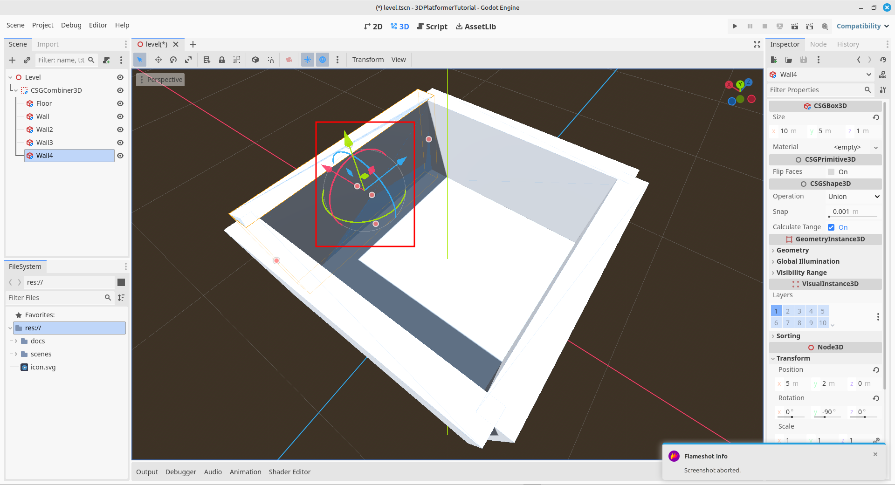
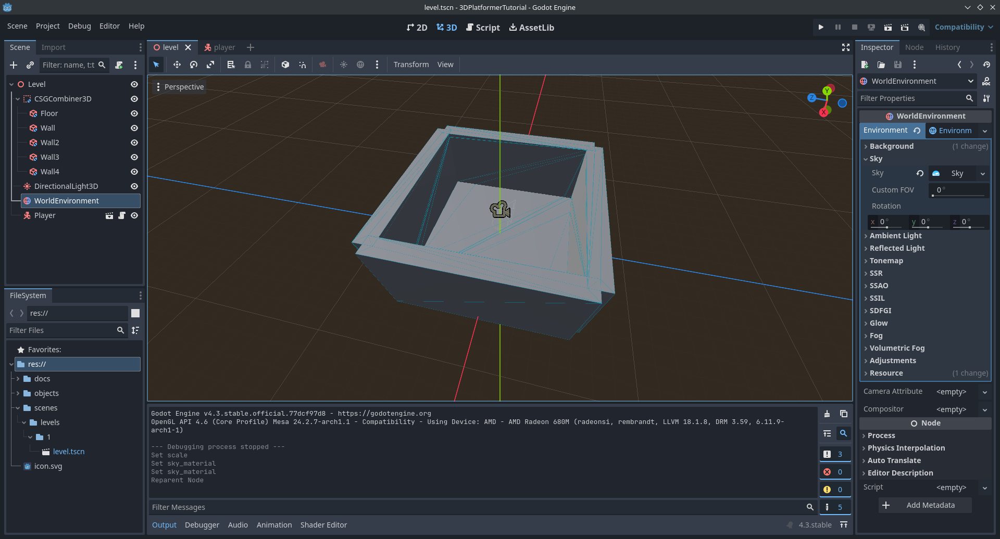
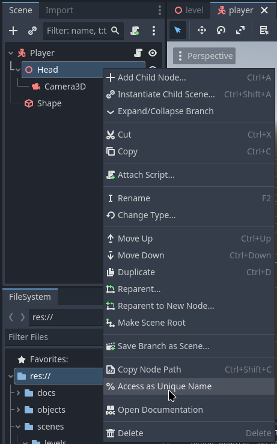
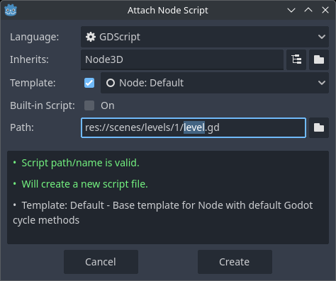
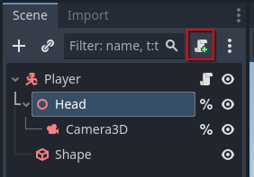
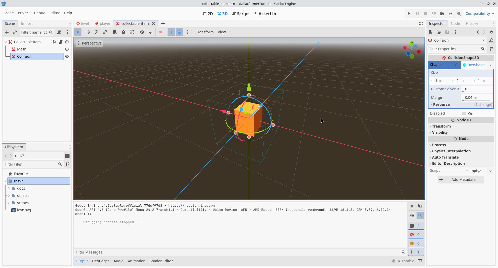
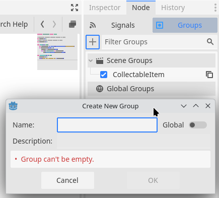
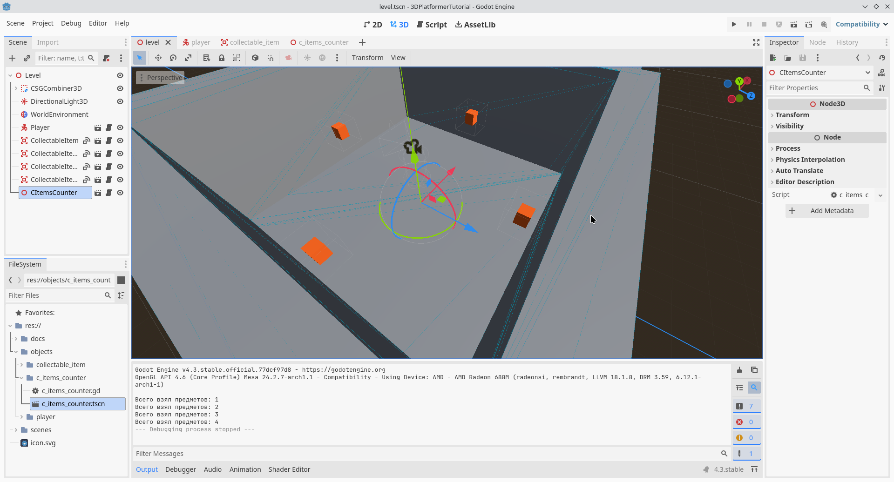
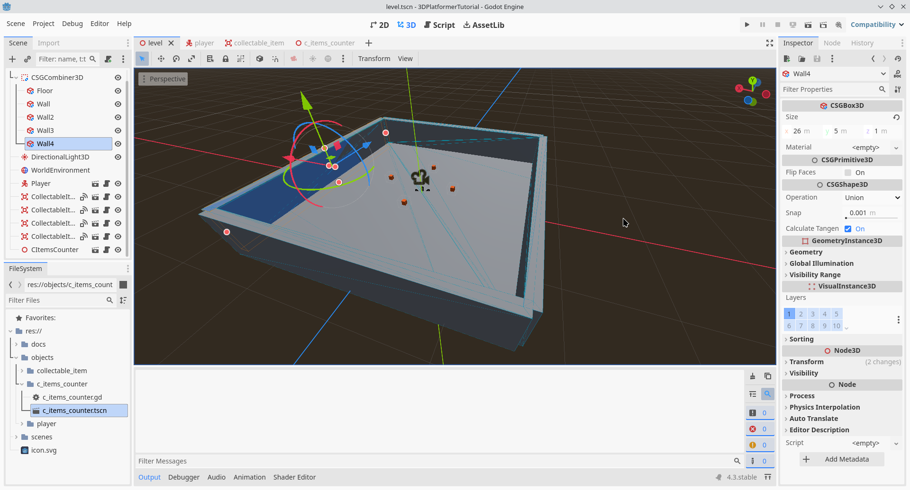
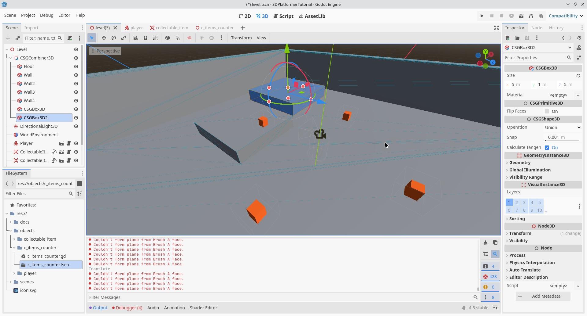

# 3D Платформер

## Содержание

- [1. Идея](#1-идея)
- [2. Подготовка проекта](#2-подготовка-проекта)
- [3. Создание уровня](#3-создание-уровня)
- [4. Создание игрока](#4-создание-игрока)
  - [4.1 Код игрока](#41-код-игрока)
- [5. Создание собираемого предмета](#5-создание-собираемого-предмета)
  - [5.1. Код собираемого объекта](#51-код-собираемого-объекта)
- [6. Подсчёт собранных предметов](#6-подсчёт-собранных-предметов)
- [6.1 Код подсчёта собранных предметов](#61-код-подсчёта-собранных-предметов)
- [7. Дополнение](#7-дополнение)
  - [7.1. Расширение территории уровня](#71-расширение-территории-уровня)
  - [7.2. Новые платформы на уровне](#72-новые-платформы-на-уровне)

## 1. Идея

[Содержание](#содержание)

3D Платформер со сбором предметов

## 2. Подготовка проекта

[Содержание](#содержание)

Чтобы задать игре клавиши под определённые действия, заходим в настройки проекта (`Project Settings`) ➡️ вкладка `Input Map` и в поле `Add New Action` вписываем названия действий и настраиваем их следующим образом:

> Обращаю внимание, что в настройках задаваемых клавиш, в области дополнительных опций (`Additional Options`) было выбрано `KeyCode (Latin Equivalent)` вместо `Phisycal KeyCode (Position on US QWERTY Keyboard)`

- `forward` (нажать клавишу `W`)
- `backward` (нажать клавишу `S`)
- `right` (нажать клавишу `D`)
- `left` (нажать клавишу `A`)
- `jump` (нажать клавишу `Space`)
- `escape` (нажать клавишу `Escape`)
- `run` (нажать клавишу `Shift`)

Примерная структура проекта будет следующей:

- `scenes` (сцены)
  - `levels` (уровни)
- `objects` (объекты)

## 3. Создание уровня

[Содержание](#содержание)

> Перемещать объекты в сцене можно прямо в редакторе с помощью "Гизмо"

<div style="text-align: center;"></div>
<p align="center">Рисунок 1 – Гизмо объекта</p>

> Удерживание клавиши `Ctrl` позволяет перемещать объекты "по сетке" посредством "Гизмо"

Примерная структура будет следующей:

- `Level` (тип `Node3D`)
  - `CSGCombiner3D`
    - `Floor` (тип `CSGBox3D`; `Size`: `(x: 10, y: 1, z: 10)`)
    - `Wall` (тип `CSGBox3D`; остальные стены будут продублированы на основе данной с помощью сочетания клавиш `Ctrl` + `D` / `ПКМ` ➡️ `Duplicate`; `Size`: `(x: 10, y: 5, z: 1)`, `Position`: `(x: 0, y: 2, z: -5)`)
    - `Wall2` (тип `CSGBox3D`; `Position`: `(x: 0, y: 2, z: 5)`)
    - `Wall3` (тип `CSGBox3D`; `Position`: `(x: -5, y: 2, z: 0)`)
    - `Wall4` (тип `CSGBox3D`; `Position`: `(x: 5, y: 2, z: 0)`)
  - `DirectionalLight3D` (`Rotation`: `(x: -45, y: 0, z: 0)`)
  - `WorldEnvironment` (`Environment` (`New Environment`, если нет) ➡️ `Background` ➡️ `Mode`: `Sky`; `Environment` ➡️ `Sky` (`New Sky`, если нет) ➡️ `Sky`: `Sky Material`: `ProceduralSkyMaterial`)

<div style="text-align: center;"></div>
<p align="center">Рисунок 2 – Примерный вариант уровня</p>

Сохраняем сцену в папке `scenes` ➡️ `levels` ➡️ `1`, название файла сцены `level.tscn`.

## 4. Создание игрока

[Содержание](#содержание)

Примерная структура будет следующей:

- `Player` (тип `CharacterBody3D`; `Position`: `(x: 0, y: 1, z: 0)`)
  - `Head` (тип `Node3D`; `Position`: `(x: 0, y: 0.8, z: 0)`)
    - `Camera3D`
  - `Shape` (тип `CollisionShape3D`; `Shape`: выбрать `CapsuleShape3D`)

Нам понадобится быстрый доступ к узлам `Head` и `Camera3D` в коде посредством обозначения их имён как уникальных. Для этого нажмите на объект `ПКМ` (`Правая Кнопка Мыши`) и выберете `Access as Unique Name` (рисунок 3).

<div style="text-align: center;"></div>
<p align="center">Рисунок 3 – Сделать имя объекта уникальным</p>

Сохраняем сцену в папке `objects` ➡️ `player`, название файла сцены `player.tscn`.

### 4.1. Код игрока

[Содержание](#содержание)

Нажимаем на узел `Player` ➡️ `ПКМ` (`Правая Кнопка Мыши`) ➡️ `Attach Script...` и создаём скрипт (автоматическое имя файла на основе имени объекта будет `player.gd`; рисунок 4).

<div style="text-align: center;"></div>
<p align="center">Рисунок 4 – Примерное окно создания нового скрипта</p>

> Также, можно нажать на ту же самую иконку во вкладке `Scene` (рисунок 5).

<div style="text-align: center;"></div>
<p align="center">Рисунок 5 – Иконка добавления нового скрипта к объекту</p>

Листинг кода игрока:

```gdscript
class_name Player extends CharacterBody3D

const WALK_SPEED := 5.0
const RUN_SPEED := 10.0
const JUMP_VELOCITY := 4.5

var gravity_mod := 1.2
var speed := WALK_SPEED
var sensitivity := 0.01
var acceleration := 1.0
var head_angle := 75.0

@onready var head: Node3D = %Head
@onready var camera: Camera3D = %Camera3D

func _ready() -> void:
	# Скрыть мышь во время запуска игры
	# Точнее, как только данный объект появится в игре
	Input.mouse_mode = Input.MOUSE_MODE_CAPTURED

func _physics_process(delta: float) -> void:
	# Гравитация
	if not is_on_floor():
		velocity += get_gravity() * gravity_mod * delta
	
	# Прыжок
	if Input.is_action_pressed("ui_accept") and is_on_floor():
		velocity.y = JUMP_VELOCITY
	
	# Бег или ходьба.
	# Без проверки `is_on_floor()` игрок может увеличивать скорость
	# в воздухе
	if Input.is_action_pressed("run"):
		speed = RUN_SPEED
	else:
		speed = WALK_SPEED
	
	# Движение персонажа
	var input_dir := Input.get_vector("left", "right", "forward", "backward")
	var direction := (head.transform.basis * Vector3(input_dir.x, 0, input_dir.y)).normalized()
	if direction:
		velocity.x = direction.x * speed
		velocity.z = direction.z * speed
	else:
		velocity.x = move_toward(velocity.x, 0, acceleration)
		velocity.z = move_toward(velocity.z, 0, acceleration)
	
	# Движение исходя из изменений `velocity`
	move_and_slide()

# Перехват ранее неперехваченных вводов
func _unhandled_input(event: InputEvent) -> void:
	if event is InputEventMouseMotion:
		head.rotate_y(-event.relative.x * sensitivity)
		camera.rotate_x(-event.relative.y * sensitivity)
		camera.rotation.x = clamp(camera.rotation.x, deg_to_rad(-head_angle), deg_to_rad(head_angle))
```

## 5. Создание собираемого предмета

[Содержание](#содержание)

Примерная структура будет следующей:

- `CollectableItem` (тип `Area3D`)
  - `Mesh` (тип `MeshInstance3D`; `Mesh` (`New BoxMesh`, если нет) ➡️ `Size`: `(x: 0.4, y: 0.5, z: 0.4)`; `Surface Material Override` (`New StandartMaterial3D`, если нет) ➡️ `Albedo` ➡️ `Color`: `ff6100`)
  - `Collision` (тип `CollisionShape3D`; `Shape` (`New BoxShape`, если нет))

<div style="text-align: center;"></div>
<p align="center">Рисунок 6 – Примерный вид собираемого предмета</p>

Также, нам нужно добавить собираемый предмет в группу, чтобы мы смогли легко его найти на уровне через код. Нажмите на данный объект, перейдите на вкладку `Node` ➡️ `Groups` и нажмите на иконку `+`. Откроется окно в котором нужно ввести группу `CollectableItem` (назовём группу также, как и сам объект) и нажмите кнопку `OK`.

<div style="text-align: center;"></div>
<p align="center">Рисунок 7 – Окно добавления группы</p>

Сохраняем сцену в папке `objects` ➡️ `collectable_item`, название файла сцены `collectable_item.tscn`.

### 5.1. Код собираемого объекта

[Содержание](#содержание)

Выбираем объект `CollectableItem` и создаём GDScript.

Листинг кода:

```gdscript
class_name CollectableItem extends Area3D

signal take_item

# Привяжите сигнал "on_body_entered" объекта "CollectableItem" к самому себе,
# чтобы данная функция (будет пустой) сама встроилась в код и работала
func _on_body_entered(body: Node3D) -> void:
	if body is Player:
		take_item.emit()
		queue_free()
```

## 6. Подсчёт собранных предметов

[Содержание](#содержание)

Для данного функционала будет использован отдельный узел.

Примерная структура будет следующей:

- `CItemsCounter` (тип `Node3D`)

Сохраняем сцену в папке `objects` ➡️ `c_items_counter`, название файла сцены `c_items_counter.tscn`.

### 6.1 Код подсчёта собранных предметов

[Содержание](#содержание)

Создаём код GDScript.

Листинг кода:

```gdscript
class_name CItemsCounter extends Node3D

# Максимальное количество собираемых предметов на уровне
var items_max := 0
# Текущее количество собранных предметов на уровне
var items_count := 0

func _ready() -> void:
	var items_in_level := get_tree().get_nodes_in_group("CollectableItem")
	if items_in_level.size() > 0:
		items_max = items_in_level.size()
		for item: CollectableItem in items_in_level:
			item.take_item.connect(_on_take_item.bind())

func _on_take_item() -> void:
	items_count += 1
	print("Всего взял предметов: %s" % [items_count])
```

## 7. Дополнение

[Содержание](#содержание)

> Чтобы добавить созданные объекты на уровень, нажмите выберете объект `Level`, нажмите сочетание клавиш `Ctrl` + `Shift` + `A` или нажмите на объект `Level` `ПКМ` (`Правая Кнопка Мыши`) и выберете `Instantiate Child Scene`. Откроется окно выбора дочерней сцены для родительской, выбираете нужную сцену и нажимаете кнопку `Open`.

Конечный вид уровня будет выглядеть примерно вот так:

<div style="text-align: center;"></div>
<p align="center">Рисунок 8 – Примерный результат</p>

### 7.1. Расширение территории уровня

[Содержание](#содержание)

Расширяем уровень. Нажимаем на пол (узел `Floor`) и видим, как рядом с Гизмо появились точки, расположенные у границ объекта. Удерживая клавишу `Ctrl` и любую выбранную точку, можно растягивать данный тип узла (`CSGBox3D`). Растяните пол и стены, как вам угодно. Примерный результат изображён на рисунке ниже.

> Касаемо стен. Не обязательно расстягивать каждую стену. Можно удалить все стены, но оставить всего одну, расширить и разместить её на уровне и продублировать с помощью сочетания клавиш `Ctrl` + `D`. Соответствующая кнопка `Duplicate` есть в контекстном меню выбранного объекта.

<div style="text-align: center;"></div>
<p align="center">Рисунок 9 – Увеличенный уровень</p>

### 7.2. Новые платформы на уровне

[Содержание](#содержание)

Чтобы добавить новые платформы, нажмите на объект `CSGCombiner3D` и добавьте к нему новый объект типа `CSGBox3D` (`Ctrl` + `A` / `Add Child Node`). Затем с помощью Гизмо перемещаете объект, расширяете его посредством точек и дублируйте сколько угодно объектов (`Ctrl` + `D` / `Duplicate`).

<div style="text-align: center;"></div>
<p align="center">Рисунок 10 – Платформы на уровне</p>
