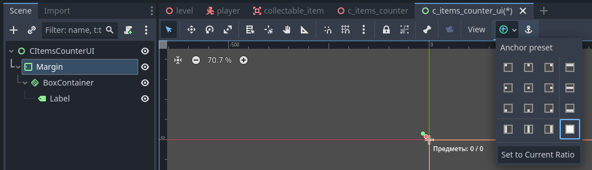
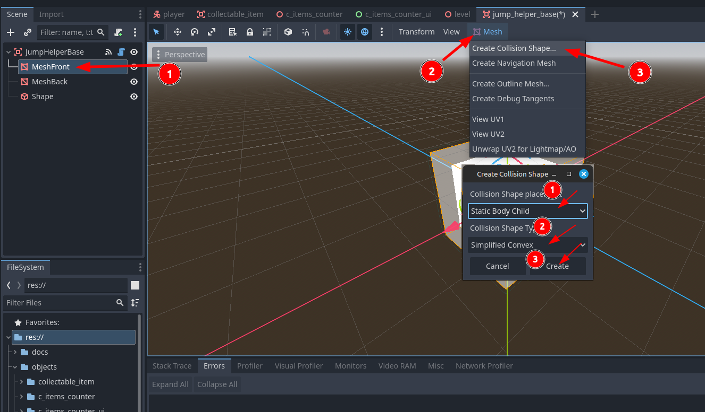

# 3D Платформер

> Часть вторая

## Содержание

- [1. Интерфейс игры: учёт собранных предметов](#1-интерфейс-игры-учёт-собранных-предметов)
  - [1.1. Код интерфейса](#11-код-интерфейса)
- [2. Батуты](#2-батуты)
  - [2.1. Создание основного батута](#21-создание-основного-батута)
  - [2.2. Изменение кода игрока](#22-изменение-кода-игрока)
  - [2.3. Код батута](#23-код-батута)
- [3. Портал](#3-портал)
  - [3.1. Код портала](#31-код-портала)

## 1. Интерфейс игры: учёт собранных предметов

[Содержание](#содержание)

Для начала вспомним, что учётом собираемых предметов занимается объект `CItemsCounter`. Так как нам скоро потребуется искать его на уровне через код, нужно облегчить будущий поиск, добавив объект `CItemsCounter` в группу `CItemsCounter`.

Зайдите на сцену данного объекта, нажмите на него и во вкладке `Node` нажмите на `Groups` и через символ `+` добавьте его в группу `CItemsCounter`.

Теперь начнём создавать пользовательский интерфейс для учёта собранных предметов.

Примерная структура будет следующей:

- `CItemsCounterUI` (тип `Control`)
  - `Margin` (тип `MarginContainer`; растяните узел согласно рисунку 1 ниже; вкладка `Theme Overrides` ➡️ вкладка `Constants`: `Margin Left` / `Margin Top` / `Margin Right` / `Margin Bottom`: `10`)
    - `BoxContainer` (`Vertical`: `true`)
      - `Info` (тип `Label`; `Text` (опционально): `Предметы: 0 / 0`)

<div style="text-align: center;"></div>
<p align="center">Рисунок 1 – Выбор пресета якорей</p>

Сохраняем сцену в папке `objects` ➡️ `c_items_counter_ui`, название файла сцены `c_items_counter_ui.tscn`.

### 1.1. Код интерфейса

[Содержание](#содержание)

Листинг кода интерфейса:

```gdscript
class_name CItemsCounterUI extends Control

var counter: CItemsCounter

@onready var info: Label = $Margin/BoxContainer/Info

func _ready() -> void:
	var first_in_group = get_tree().get_first_node_in_group("CItemsCounter")
	if first_in_group != null:
		counter = first_in_group

func _process(delta: float) -> void:
	if counter != null:
		info.text = "Предметов: %s / %s" % [counter.items_count, counter.items_max]
```

> 🗒️ **Обратите внимание!**
> 
> После того, как вы добавите данный объект на уровень, у игрока пропадёт возможность вращения посредством мыши. Это происходит из-за того, что у нас в коде игрока логика вращения находится в функции `_unhandled_input` (необработанный ввод). Так как на уровне появился первый интерфейс, узлы типа `Control` и его наследующие типы по умолчанию обрабатывают ввод мыши, а до его добавления только игрок обрабатывал ввод мыши, благодаря чему обработка через `_unhandled_input` являлась возможным. Чтобы исправить это, просто измените имя функции с `_unhandled_input` на `_input` и вращение игрока должно вернуться.

## 2. Батуты

[Содержание](#содержание)

### 2.1. Создание основного батута

[Содержание](#содержание)

Примерная структура будет следующей:

- `JumpHelperBase` (тип `Area3D`)
  - `MeshFront` (тип `MeshInstance3D`; `Mesh`: `BoxMesh` ➡️ `Size`: `(x: 2, y: 2, z: 2)`; вкладка `Surface Material Override` ➡️ создайте `StandartMaterial3D`: вкладка `Transparency` ➡️ `Transparency`: `Alpha`, вкладка `Albedo` ➡️ `Color`: `ffffff80`)
  - `MeshBack` (тип `MeshInstance3D`; `Mesh`: `BoxMesh` ➡️ `Size`: `(x: 1.5, y: 1.5, z: 1.5)`; вкладка `Surface Material Override` ➡️ создайте `StandartMaterial3D`)
  - `Shape` (тип `CollisionShape3D`; `Shape`: `BoxShape3D`: `Size`: `(x: 2.1, y: 2.1, z: 2.1)`)

Чтобы добавить коллизию у данного батута, нажимаем на узел `MeshFront` и выполяем последовательность действий, показанные на рисунке 2.

<div style="text-align: center;"></div>
<p align="center">Рисунок 2 – Создание коллизии у меша</p>

Сохраняем сцену в папке `objects` ➡️ `jump_helper_base`, название файла сцены `jump_helper_base.tscn`.

### 2.2. Изменение кода игрока

[Содержание](#содержание)

Прежде чем добавлять код к основному батуту, предлагаю дополнить код игрока. Учитывайте комментарии к строкам кода, добавленным в листинг. Были исправлены недочёты в управлении и вращении игрока.

Листинг кода:

```gdscript
# Добавьте к константам
const JUMP_MOD_DEFAULT := 1.0

# Добавьте к обычным переменным
var is_jump_modified := false
var jump_mod := JUMP_MOD_DEFAULT

func _physics_process(delta: float) -> void:
	# Код Гравитации
	...
	# Замените код Прыжка
	if Input.is_action_pressed("ui_accept") and is_on_floor():
		if is_jump_modified:
			velocity.y = JUMP_VELOCITY * jump_mod
		else:
			velocity.y = JUMP_VELOCITY
  ...
  # Движение персонажа (в этой строчке ничего не изменено)
	var input_dir := Input.get_vector("left", "right", "forward", "backward")
	# убран `head` в `transform.basis`
	var direction := (transform.basis * Vector3(input_dir.x, 0, input_dir.y)).normalized()
  ...

# Перехват ранее неперехваченных вводов
func _input(event: InputEvent) -> void:
	if event is InputEventMouseMotion:
		# убран `head` в начале строки
		rotate_y(-event.relative.x * sensitivity)
		# замена `camera` на `head`
		head.rotate_x(-event.relative.y * sensitivity)
		head.rotation.x = clamp(head.rotation.x, deg_to_rad(-head_angle), deg_to_rad(head_angle))
```

### 2.3. Код батута

[Содержание](#содержание)

Листинг кода батута:

```gdscript
# @tool даёт возможность выполнять операции непосредственно в редакторе
# ИСПОЛЬЗУЙТЕ ОСТОРОЖНО!
# Рекомендую добавить данную строку в конце работы над скриптом
@tool
class_name JumpHelperBase extends Area3D

# @export_range - ограниченный диапозон значений у переменной
@export_range(1.0, 100.0) var jump_mod := 1.0
@export var color: Color = Color.WHITE

@onready var mesh_front: MeshInstance3D = $MeshFront
@onready var mesh_back: MeshInstance3D = $MeshBack

var mesh_front_material: StandardMaterial3D
var mesh_back_material: StandardMaterial3D

func _ready() -> void:
	check_materials()
	get_meshes_color()

func _process(_delta: float) -> void:
	# Изменение цвета в редакторе
	if Engine.is_editor_hint():
		get_meshes_color()

# Если материалы не найдены
func check_materials(fallback_return: bool = false) -> void:
	if mesh_front_material == null or mesh_back_material == null:
		mesh_front_material = mesh_front.get_surface_override_material(0).duplicate() as StandardMaterial3D
		mesh_back_material = mesh_back.get_surface_override_material(0).duplicate() as StandardMaterial3D
		mesh_front.set_surface_override_material(0, mesh_front_material)
		mesh_back.set_surface_override_material(0, mesh_back_material)
		return

func get_meshes_color() -> void:
	check_materials(true)
	
	# Убрать лишние операции
	if mesh_front_material.albedo_color.r == color.r and \
		mesh_front_material.albedo_color.g == color.g and \
		mesh_front_material.albedo_color.b == color.b and \
		mesh_back_material.albedo_color.r == color.r and \
		mesh_back_material.albedo_color.g == color.g and \
		mesh_back_material.albedo_color.b == color.b:
			return
	
	mesh_front_material.albedo_color.r = color.r
	mesh_front_material.albedo_color.g = color.g
	mesh_front_material.albedo_color.b = color.b
	
	mesh_back_material.albedo_color.r = color.r
	mesh_back_material.albedo_color.g = color.g
	mesh_back_material.albedo_color.b = color.b

# Нужно привязать сигнал "_on_body_entered" у обладателя данного скрипта
func _on_body_entered(body: Node3D) -> void:
	if body is Player:
		body.jump_mod = jump_mod
		body.is_jump_modified = true

# Нужно привязать сигнал "_on_body_exited" у обладателя данного скрипта
func _on_body_exited(body: Node3D) -> void:
	if body is Player:
		body.is_jump_modified = false
```

## 3. Портал

[Содержание](#содержание)

Создадим портал, который будет перемещать игрока к другому порталу и сделаем возможность у последнего портала проверять количество собранных предметов игроком для разблокировки.

Примерная структура будет следующей:

- `Portal` (тип `Area3D`)
  - `Mesh` (тип `MeshInstance3D`; `Mesh`: `BoxMesh` ➡️ `Size`: `(x: 0.1, y: 2, z: 1)`; вкладка `Surface Material Override` ➡️ создайте `StandartMaterial3D`: вкладка `Albedo` ➡️ `Color`: `009500`)
  - `Shape` (тип `CollisionShape3D`; `Shape`: `BoxShape3D`: `Size`: `(x: 0.2, y: 2.1, z: 1.1)`)
  - `ForwardPos` (тип `Marker3D`; вкладка `Transform` ➡️ `Position`: `(x: 1, y: 0, z: 0)`)
  - `ForwardLookPos` (тип `Marker3D`; вкладка `Transform` ➡️ `Position`: `(x: 2, y: 0, z: 0)`)

Сохраняем сцену в папке `objects` ➡️ `portal`, название файла сцены `portal.tscn`.

### 3.1. Код портала

[Содержание](#содержание)

Листинг кода портала:

```gdscript
class_name Portal extends Area3D

@export var is_end: bool
@export var is_touchable: bool = true
@export var next_portal: Portal
@export var next_level: PackedScene

var c_items_counter: CItemsCounter

@onready var forward_pos: Marker3D = $ForwardPos
@onready var forward_look_pos: Marker3D = $ForwardLookPos

func _ready() -> void:
	if not is_end:
		set_process(false)
	else:
		var c_items_counter_find = get_tree().get_first_node_in_group("CItemsCounter")
		if c_items_counter_find == null:
			set_process(false)
			print("Последний портал: \"Никто не считает предметы... ну и ладно\"")
		else:
			c_items_counter = c_items_counter_find
			is_touchable = false

func get_global_forward_position() -> Vector3:
	return forward_pos.global_position

func set_player_look_at_forward_position(player: Player) -> void:
	player.look_at(forward_look_pos.global_position)

# Будет работать только если портал является последним и игрок не собрал все предметы
func _process(_delta: float) -> void:
	if c_items_counter.items_count >= c_items_counter.items_max:
		print("Портал увидел, что игрок собрал все предметы и он разблокировался!")
		is_touchable = true
		set_process(false)

# Нужно привязать сигнал "_on_body_entered" у обладателя данного скрипта
func _on_body_entered(body: Node3D) -> void:
	if body is Player and is_touchable:
		if not is_end:
			next_portal.is_touchable = false
			body.global_position = next_portal.get_global_forward_position()
			next_portal.set_player_look_at_forward_position(body)
			await get_tree().create_timer(0.25).timeout
			next_portal.is_touchable = true
		else:
			if next_level:
				get_tree().change_scene_to_packed(next_level)
			else:
				get_tree().quit()
```
