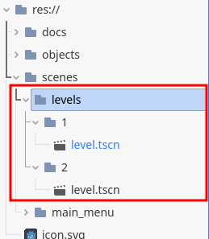
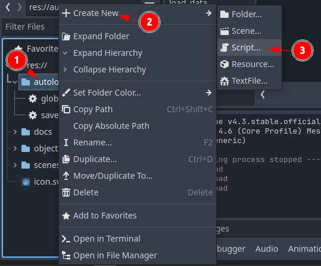
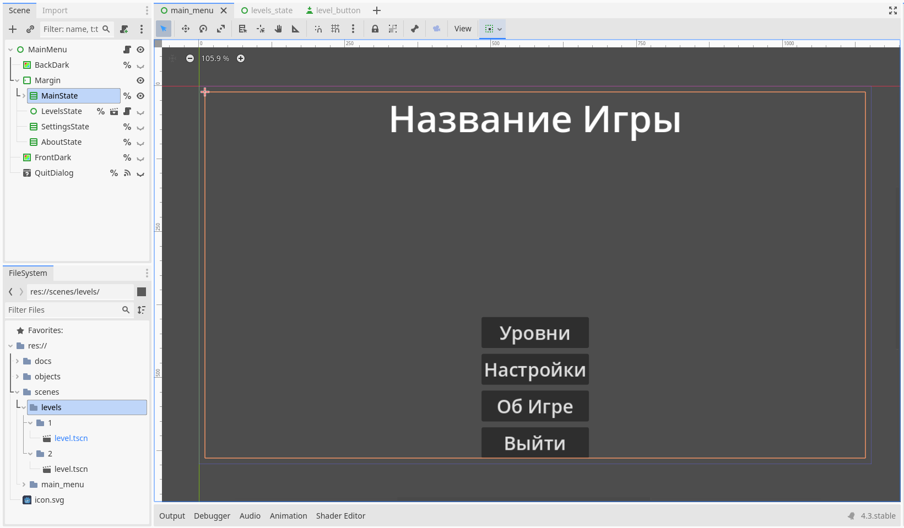
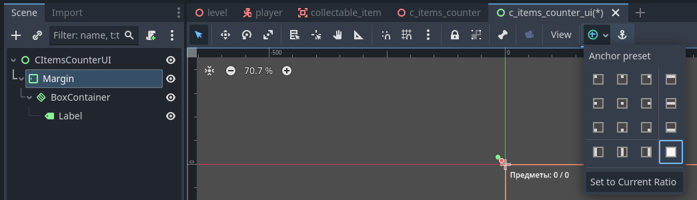
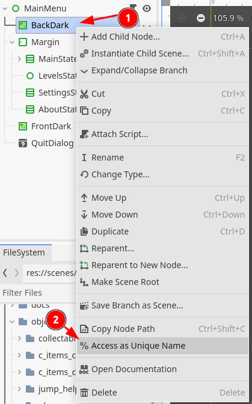
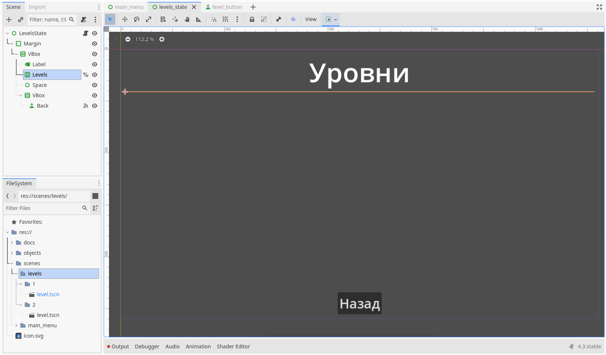
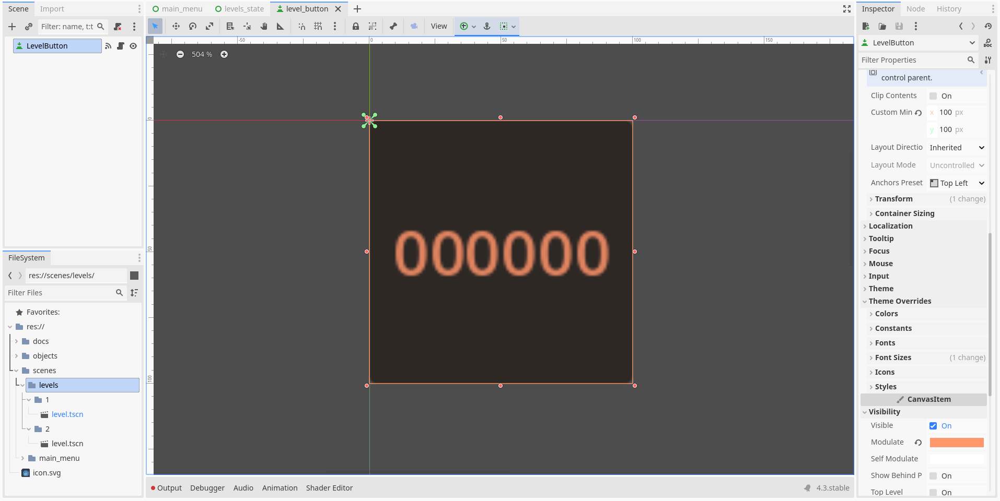
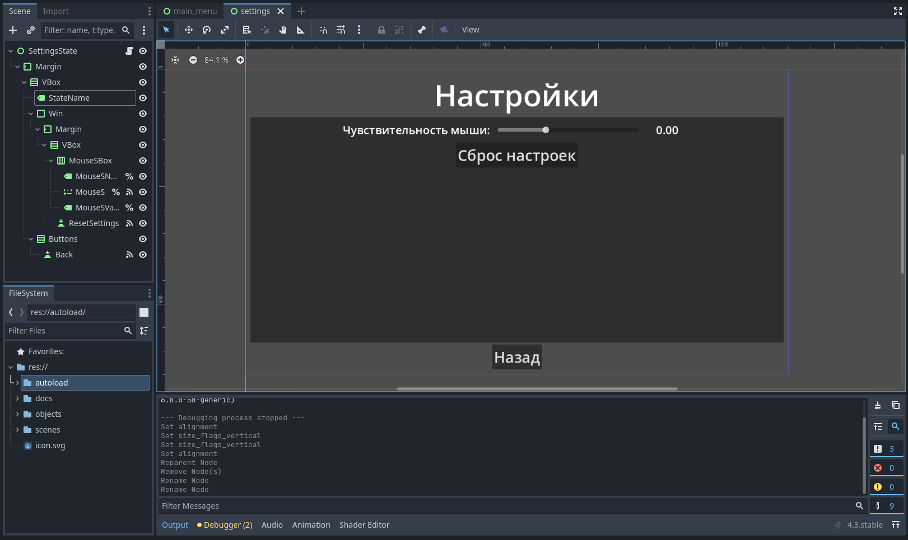
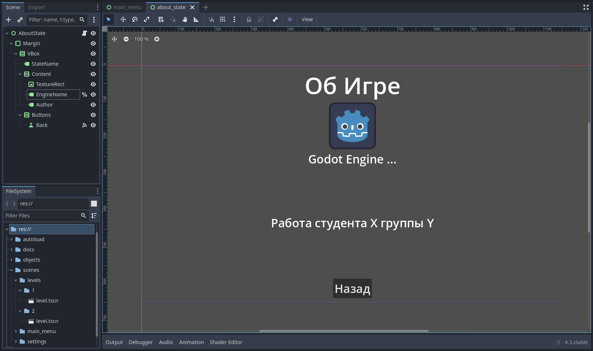
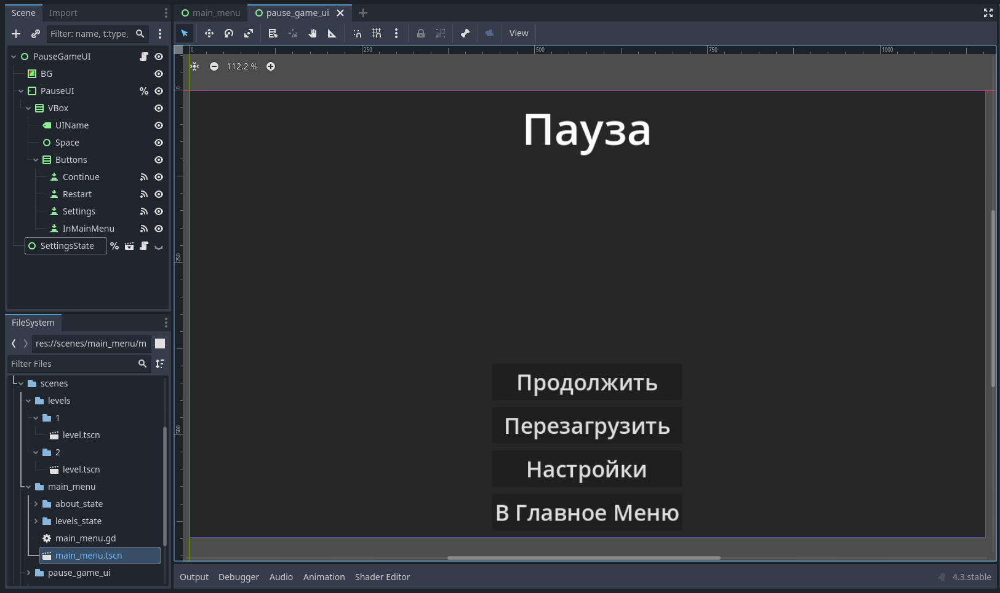

# 3D Платформер

> Часть третья

## Содержание

- [1. Подготовительный этап](#1-подготовительный-этап)
- [2. Главное меню](#2-главное-меню)
  - [2.1. Код главного меню](#21-код-главного-меню)
- [3. Экран выбора уровня](#3-экран-выбора-уровня)
  - [3.1. Кнопка выбора уровня](#31-кнопка-выбора-уровня)
    - [3.1.1. Код кнопки выбора уровня](#311-код-кнопки-выбора-уровня)
  - [3.2. Код экрана выбора уровня](#32-код-экрана-выбора-уровня)
- [4. Экран настроек](#4-экран-настроек)
  - [4.1. Код экрана настроек](#41-код-экрана-настроек)
- [5. Экран "Об Игре"](#5-экран-об-игре)
  - [5.1. Код экрана "Об Игре"](#51-код-экрана-об-игре)
- [6. Экран паузы](#6-экран-паузы)
  - [6.1. Код экрана паузы](#61-код-экрана-паузы)
- [7. Обновления кода](#7-обновления-кода)

## 1. Подготовительный этап

Прежде чем будем создавать главное меню игры, мы должны решить, как будем формировать список уровней в дальнейшем и какая структура будет использована.

Согласно данному материалу, в течение всех трёх частей использовалась такая архитектура проекта:

- `res://` (корень проекта, сама папка нашего проекта)
  - `autoload` (папка с глобальными скриптами, будет создана позже)
  - `objects` (папка с объектами)
    - `player` (показан как пример объекта)
      - `player.tscn` (сцена объекта)
      - `player.gd` (код объекта)
  - `scenes` (сцены)
    - `levels` (папка с уровнями)
      - `1` (номер уровня)
        - `level.tscn` (сам уровень)
      - `2`
      - `*и так далее*`
    - `*другие папки со сценами*` (например, главное меню)

В рамках данного материала, для формирования списка уровней будет использоваться именно данная структура проекта (рисунок 1.1). Если у вас есть различия в структуре уровней (например, путь до первого уровня отличается от `scenes` ➡️ `levels` ➡️ `1` ➡️ `level.tscn`), рекомендуется потратить время на исправление структуры папок с уровнями.

<div style="text-align: center;"></div>
<p align="center">Рисунок 1.1 – Структура внутри папки levels</p>

Также, нам впервые понадобятся глобальные переменные и функции. Создайте папку в корне проекта и назовите её `autoload`. В папке `autoload` создайте скрипты `global.gd` и `save_load.gd`, используя рисунок 1.2 в качестве подсказки.

<div style="text-align: center;"></div>
<p align="center">Рисунок 1.2 – Создание глобальных скриптов</p>

Листинг кода скрипта `global.gd`:

```gdscript
extends Node

var sensitivity := 1.0

# Прохождение уровней также можно сохранить
# Например, для блокирования всех уровней кроме первого
# в начале игры
```

Листинг кода скрипта `save_load.gd`:

```gdscript
extends Node

const SETTINGS_DATA_PATH := "user://settings.data"

var settings_data_template := {
	"sensitivity": 0.0,
}

func _ready() -> void:
	load_data()

func save_data() -> void:
	var file := FileAccess.open(SETTINGS_DATA_PATH, FileAccess.WRITE)
	var settings_data := settings_data_template.duplicate()
	
	settings_data.sensitivity = Global.sensitivity
	file.store_string(JSON.stringify(settings_data))

func load_data() -> void:
	if FileAccess.file_exists(SETTINGS_DATA_PATH):
		var file := FileAccess.open(SETTINGS_DATA_PATH, FileAccess.READ)
		var parsed_data = JSON.parse_string(file.get_as_text())
		
		if parsed_data is Dictionary:
			if parsed_data.has("sensitivity"):
				if parsed_data.sensitivity >= 0.01:
					Global.sensitivity = parsed_data.sensitivity
```

> Чтобы открыть папку с сохранениями данного проекта, нажмите на `Project` ➡️ `Open User Data Folder`.

## 2. Главное меню

> Если вы не видите некоторых объектов на сцене, убедитесь, что они показываются на сцене с помощью иконки `глаза` во вкладке `Scene` в редакторе.

Создаём новую сцену. Её структура будет примерно следующей:

- `MainMenu` (тип `Control`; растяните объект согласно примеру из рисунка 2.2 ниже)
  - `BackDark` (тип `ColorRect`; `Color`: `00000080`; растяните его и сделайте его имя уникальным согласно примеру из рисунка 2.3 ниже)
  - `Margin` (тип `MarginContainer`; растяните его; вкладка `Theme Overrides` ➡️ вкладка `Constants`: `Margin Left` / `Margin Top` / `Margin Right` / `Margin Bottom`: `10`)
    - `MainState` (тип `VBoxContainer`; сделайте его имя уникальным)
    - `LevelsState` (тип `VBoxContainer`; сделайте его имя уникальным)
    - `SettingsState` (тип `VBoxContainer`; сделайте его имя уникальным)
    - `AboutState` (тип `VBoxContainer`; сделайте его имя уникальным)
  - `FrontDark` (тип `ColorRect`; `Color`: `00000080`; растяните его и сделайте его имя уникальным)
  - `QuitDialog` (тип `ConfirmationDialog`; `Cancel Button Text`: `Нет`, `OK Button Text`: `Да`, влкадка `Dialog` ➡️ `Text`: `Выйти из игры?`, `Title`: `Вопрос`, `Initial Position`: `Center of Main Window Screen`, вкладка `Flags` ➡️ `Unresizable`: `true`)

Рассмотрим отдельно иерархию у узла `MainState`:

- `MainState` (тип `VBoxContainer`; это сам узел `MainState`)
  - `GameName` (тип `Label`; `Label Settings`: `New Label Settings` ➡️ вкладка `Font` ➡️ `Size`: `64`, `Horizontal Alignment`: `Center`, `Text`: `Название Игры`)
  - `Space` (тип `Control`; вкладка `Layout` ➡️ вкладка `Container Sizing` ➡️ `Vertical (Expand)`: `true`)
  - `Buttons` (тип `VBoxContainer`; вкладка `Layout` ➡️ вкладка `Container Sizing` ➡️ `Horizontal`: `Shrink Center`, вкладка `Theme Overrides` ➡️ вкладка `Constants`: `Separation`: `10`)
    - `SelectLevel` (тип `Button`; `Text`: `Уровни`, вкладка `Theme Overrides` ➡️ вкладка `Font Sizes` ➡️ `Font Size`: `32`)
    - `Settings` (тип `Button`; `Text`: `Настройки`, вкладка `Theme Overrides` ➡️ вкладка `Font Sizes` ➡️ `Font Size`: `32`)
    - `About` (тип `Button`; `Text`: `Об Игре`, вкладка `Theme Overrides` ➡️ вкладка `Font Sizes` ➡️ `Font Size`: `32`)
    - `Quit` (тип `Button`; `Text`: `Выход`, вкладка `Theme Overrides` ➡️ вкладка `Font Sizes` ➡️ `Font Size`: `32`)

> Не бойтесь скрывать некоторые узлы в иерархии через иконку `глаза` во вкладке `Scene` в редакторе.

Узлы `LevelsState`, `SettingsState` и `AboutState` будут заменены другими сценами в будущем.

Сохраняем сцену в папке `scenes` ➡️ `main_menu`, название файла сцены `main_menu.tscn`.

<div style="text-align: center;"></div>
<p align="center">Рисунок 2.1 – Главное меню</p>

<div style="text-align: center;"></div>
<p align="center">Рисунок 2.2 – Пример растягивания якорей</p>

<div style="text-align: center;"></div>
<p align="center">Рисунок 2.3 – Пример задания уникального имени для выбранного объекта</p>

### 2.1. Код главного меню

Листинг кода главного меню:

```gdscript
class_name MainMenu extends Control

enum States { Main, Levels, Settings, About, Quit }
var current_state: States = States.Main

@onready var main_state: VBoxContainer = %MainState
# Их заменим позже
@onready var levels_state: VBoxContainer = %LevelsState
@onready var settings_state: VBoxContainer = %SettingsState 
@onready var about_state: VBoxContainer = %AboutState 

@onready var back_dark: ColorRect = %BackDark
@onready var front_dark: ColorRect = %FrontDark
@onready var quit_dialog: ConfirmationDialog = %QuitDialog

func _ready() -> void:
    Input.mouse_mode = Input.MOUSE_MODE_VISIBLE
	set_state(States.Main)

func check_state() -> void:
	match current_state:
		States.Main:
			back_dark.hide()
			main_state.show() # Показываем главный экран меню
			levels_state.hide()
			settings_state.hide()
			about_state.hide()
			front_dark.hide()
			quit_dialog.hide()
		States.Levels:
			back_dark.show() # Затемняем пространство за экранами
			main_state.hide()
			levels_state.show() # Показываем экран выбора уровня
			settings_state.hide()
			about_state.hide()
			front_dark.hide()
			quit_dialog.hide()
		States.Settings:
			back_dark.show() # Затемняем пространство за экранами
			main_state.hide()
			levels_state.hide()
			settings_state.show() # Показываем экран настроек
			about_state.hide()
			front_dark.hide()
			quit_dialog.hide()
		States.About:
			back_dark.show() # Затемняем пространство за экранами
			main_state.hide()
			levels_state.hide()
			settings_state.hide()
			about_state.show() # Показываем экран об игре
			front_dark.hide()
			quit_dialog.hide()
		States.Quit:
			back_dark.hide()
			main_state.show() # Показываем главный экран меню
			levels_state.hide()
			settings_state.hide()
			about_state.hide()
			front_dark.show() # Затемняем пространство после экранов
			quit_dialog.show() # Показывам диалог выхода из игры

func set_state(value: States) -> void:
	current_state = value
	check_state()

# Нужно привязать сигнал "pressed" у кнопки "SelectLevel"
func _on_select_level_pressed() -> void:
	set_state(States.Levels)

# Нужно привязать сигнал "pressed" у кнопки "Settings"
func _on_settings_pressed() -> void:
	set_state(States.Settings)

# Нужно привязать сигнал "pressed" у кнопки "About"
func _on_about_pressed() -> void:
	set_state(States.About)

# Нужно привязать сигнал "pressed" у кнопки "Quit"
func _on_quit_pressed() -> void:
	set_state(States.Quit)

# Нужно привязать сигнал "confirmed" у объекта "QuitDialog"
func _on_quit_dialog_confirmed() -> void:
	get_tree().quit()

# Нужно привязать сигнал "canceled" у объекта "QuitDialog"
func _on_quit_dialog_canceled() -> void:
	set_state(States.Main)
```

> Чтобы изменить главную сцены в проекте зайдите в настройки проекта `Project Settings` ➡️ `General` ➡️ `Application` ➡️ `Run` и в поле `Main Scene` укажите сцену с главным меню.

## 3. Экран выбора уровня

Создаём новую сцену. Её структура будет примерно следующей:

- `LevelsState` (тип `Control`; растяните его)
  - `Margin` (тип `MarginContainer`; растяните его; вкладка `Theme Overrides` ➡️ вкладка `Constants`: `Margin Left` / `Margin Top` / `Margin Right` / `Margin Bottom`: `10`)
    - `VBox` (тип `VBoxContainer`)
      - `NameState` (тип `Label`; `Label Settings`: `New Label Settings` ➡️ вкладка `Font` ➡️ `Size`: `64`, `Horizontal Alignment`: `Center`, `Text`: `Уровни`)
      - `Levels` (тип `HBoxContainer`; сделайте его имя уникальным)
      - `Space` (тип `Control`; вкладка `Layout` ➡️ вкладка `Container Sizing` ➡️ `Vertical (Expand)`: `true`)
      - `Buttons` (тип `VBoxContainer`; вкладка `Layout` ➡️ вкладка `Container Sizing` ➡️ `Horizontal`: `Shrink Center`)
        - `Back` (тип `Button`; `Text`: `Назад`, вкладка `Theme Overrides` ➡️ вкладка `Font Sizes` ➡️ `Font Size`: `32`)

<div style="text-align: center;"></div>
<p align="center">Рисунок 3.1 – Экран выбора уровня</p>

Сохраняем сцену в папке `scenes` ➡️ `main_menu` ➡️ `levels_state`, название файла сцены `levels_state.tscn`.

### 3.1. Кнопка выбора уровня

Создаём новую сцену. Её структура будет примерно следующей:

- `LevelButton` (тип `Button`; вкладка `Theme Overrides` ➡️ вкладка `Font Sizes` ➡️ `Font Size`: `32`, вкладка `Visibility` ➡️ `Modulate`: `ff966c`, кладка `Layout` ➡️ `Custom Minimum Size`: `(x: 100, y: 100)`)

<div style="text-align: center;"></div>
<p align="center">Рисунок 3.1.1 – Кнопка выбора уровня</p>

Сохраняем сцену в папке `scenes` ➡️ `main_menu` ➡️ `levels_state` ➡️ `level_button`, название файла сцены `level_button.tscn`.

#### 3.1.1. Код кнопки выбора уровня

Листинг кода кнопки выбора уровня:

```gdscript
class_name LevelButton extends Button

@export var level: PackedScene
@export var level_idx: int

func _ready() -> void:
	text = "%s" % [level_idx]

# Нужно привязать сигнал "pressed" у обладателя данного скрипта
func _on_pressed() -> void:
	get_tree().change_scene_to_packed(level)
```

### 3.2. Код экрана выбора уровня

Листинг кода экрана выбора уровня:

```gdscript
class_name LevelsState extends Control

const MIN_LEVEL_IDX := 1
const LEVEL_BUTTON := preload("res://scenes/main_menu/levels_state/level_button/level_button.tscn")

@export var main_menu: MainMenu

var levels_path := "res://scenes/levels/"
var found_levels := []
var found_level_template := {
	"idx": 0,
	"path": "",
}

@onready var levels: HBoxContainer = %Levels

func _ready() -> void:
	find_levels()

# Поиск уровней в игре
# Важно соблюдать правила наименований папок с уровнями
func find_levels() -> void:
	var current_idx := MIN_LEVEL_IDX
	var current_level_folder := levels_path + "%s/" % [current_idx]
	while DirAccess.dir_exists_absolute(current_level_folder):
		var current_level := current_level_folder + "level.tscn"
		if FileAccess.file_exists(current_level):
			var new_level := found_level_template.duplicate()
			new_level.idx = current_idx
			new_level.path = current_level
			found_levels.append(new_level)
			
			current_idx += 1
			current_level_folder = levels_path + "%s/" % [current_idx]
	load_levels()

func load_levels() -> void:
	for current_level: Dictionary in found_levels:
		var level_button := LEVEL_BUTTON.instantiate()
		level_button.level_idx = current_level.idx
		level_button.level = load(current_level.path)
		levels.add_child(level_button)

# Нужно привязать сигнал "pressed" у кнопки "Back"
func _on_back_pressed() -> void:
	main_menu.set_state(main_menu.States.Main)
```

> Данный объект переносим в иерархию сцены `MainMenu` в качестве замены пустого объекта `LevelsState`. Не забудьте сделать его имя уникальным и убедитесь, что имя нового объекта не содержит чисел и других новых символов. Также в скрипте у `MainMenu` исправьте строку объявления переменной данного объекта (начинается с `@onready var levels_state ...`), изменив тип на `LevelsState`.

## 4. Экран настроек

Создаём новую сцену. Её структура будет примерно следующей:

- `SettingsState` (тип `Control`; растяните его)
  - `Margin` (тип `MarginContainer`; растяните его; вкладка `Theme Overrides` ➡️ вкладка `Constants`: `Margin Left` / `Margin Top` / `Margin Right` / `Margin Bottom`: `10`)
    - `VBox` (тип `VBoxContainer`)
      - `StateName` (тип `Label`; `Label Settings`: `New Label Settings` ➡️ вкладка `Font` ➡️ `Size`: `64`, `Horizontal Alignment`: `Center`, `Text`: `Настройки`)
      - `Win` (тип `PanelContainer`; вкладка `Layout` ➡️ вкладка `Container Sizing` ➡️ `Vertical (Expand)`: `true`)
        - `Margin` (тип `MarginContainer`; вкладка `Theme Overrides` ➡️ вкладка `Constants`: `Margin Left` / `Margin Top` / `Margin Right` / `Margin Bottom`: `10`)
    - `Buttons` (тип `VBoxContainer`; вкладка `Layout` ➡️ вкладка `Container Sizing` ➡️ `Horizontal`: `Shrink Center`)
      - `Back` (тип `Button`; `Text`: `Выход`, вкладка `Theme Overrides` ➡️ вкладка `Font Sizes` ➡️ `Font Size`: `32`)

Рассмотрим отдельно иерархию у узла `Margin` в узле `Win`:

- `Margin` (тип `MarginContainer`; это сам узел `Margin`)
  - `VBox` (тип `VBoxContainer`; вкладка `Theme Overrides` ➡️ вкладка `Constants`: `Separation`: `10`)
    - `MouseSBox` (тип `HBoxContainer`; вкладка `Theme Overrides` ➡️ вкладка `Constants`: `Separation`: `10`, `Alignment`: `Center`)
      - `MouseSName` (тип `Label`; сделайте его имя уникальным; `Label Settings`: `New Label Settings` ➡️ вкладка `Font` ➡️ `Size`: `24`, `Horizontal Alignment`: `Center`, `Text`: `Чувствительность мыши:`)
      - `MouseS` (тип `HSlider`; сделайте его имя уникальным;`Min Value`: `0.01`, `Max Value`: `3`, `Step`: `0.01`, `Value`: `1`, вкладка `Layout` ➡️ вкладка `Container Sizing` ➡️ `Vertical`: `Fill`, вкладка `Layout` ➡️ `Custom Minimum Size`: `(x: 300, y: 0)`)
      - `MouseSValue` (тип `Label`; сделайте его имя уникальным; `Label Settings`: `New Label Settings` ➡️ вкладка `Font` ➡️ `Size`: `24`, `Horizontal Alignment`: `Center`, `Text`: `0.00`, вкладка `Layout` ➡️ `Custom Minimum Size`: `(x: 100, y: 0)`)
    - `ResetSettings` (тип `Button`; `Button`; `Text`: `Сброс настроек`, вкладка `Theme Overrides` ➡️ вкладка `Font Sizes` ➡️ `Font Size`: `32`)

Сохраняем сцену в папке `scenes` ➡️ `settings`, название файла сцены `settings.tscn`.

<div style="text-align: center;"></div>
<p align="center">Рисунок 4.1 – Экран настроек</p>

### 4.1. Код экрана настроек

Листинг кода экрана настроек:

```gdscript
class_name Settings extends Control

@export var main_menu: MainMenu
# Уберите комментарий у строки ниже, когда мы создадим экран паузы
# @export var pause_menu: PauseGameUI

@onready var mouse_s_name: Label = %MouseSName
@onready var mouse_s: HSlider = %MouseS
@onready var mouse_s_value: Label = %MouseSValue

func _ready() -> void:
	update_mouse_s_value(Global.sensitivity)
	mouse_s.value = Global.sensitivity

func update_mouse_s_value(value: float) -> void:
	mouse_s_value.text = "%s" % [value]

# Нужно привязать сигнал "value_changed" у слайдера "MouseS"
func _on_mouse_s_value_changed(value: float) -> void:
	update_mouse_s_value(value)
	Global.sensitivity = value

# Нужно привязать сигнал "pressed" у кнопки "Back"
func _on_back_pressed() -> void:
	if main_menu:
		main_menu.set_state(main_menu.States.Main)
	#elif pause_menu:
		#pause_menu.set_state(pause_menu.States.Pause)
	SaveLoad.save_data()

# Нужно привязать сигнал "pressed" у кнопки "ResetSettings"
func _on_reset_settings_pressed() -> void:
	Global.sensitivity = 1.0
	mouse_s.value = Global.sensitivity
	update_mouse_s_value(mouse_s.value)
	SaveLoad.save_data()
```

> Данный объект переносим в иерархию сцены `MainMenu` в качестве замены пустого объекта `SettingsState`. Не забудьте сделать его имя уникальным и убедитесь, что имя нового объекта не содержит чисел и других новых символов. Также в скрипте у `MainMenu` исправьте строку объявления переменной данного объекта (начинается с `@onready var settings_state ...`), изменив тип на `Settings`.
> 
> Не забудьте у узла `SettingsState` указать главное меню в соответствующем свойстве (`Main Menu`)

## 5. Экран "Об Игре"

Создаём новую сцену. Её структура будет примерно следующей:

- `AboutState` (тип `Control`)
  - `Margin` (тип `MarginContainer`; вкладка `Theme Overrides` ➡️ вкладка `Constants`: `Margin Left` / `Margin Top` / `Margin Right` / `Margin Bottom`: `10`)
    - `VBox` (тип `VBoxContainer`)
      - `StateName` (тип `Label`; `Label Settings`: `New Label Settings` ➡️ вкладка `Font` ➡️ `Size`: `64`, `Horizontal Alignment`: `Center`, `Text`: `Об Игре`)
      - `Content` (тип `VBoxContainer`; вкладка `Layout` ➡️ вкладка `Container Sizing` ➡️ `Vertical (Expand)`: `true`)
        - `TextureRect` (`Texture`: файл `icon.svg` перетащив в свойство или через контекстное меню по свойству ➡️ `Quick Load...`)
        - `EngineName` (тип `Label`; сделайте его имя уникальным; `Label Settings`: `New Label Settings` ➡️ вкладка `Font` ➡️ `Size`: `32`, `Horizontal Alignment`: `Center`, `Text` (опционально): `Godot Engine ...`)
        - `Author` (тип `Label`; `Label Settings`: `New Label Settings` ➡️ вкладка `Font` ➡️ `Size`: `32`, `Horizontal Alignment`: `Center`, `Vertical Alignment`: `Center`, `Text`: `Работа студента X группы Y`, вкладка `Layout` ➡️ вкладка `Container Sizing` ➡️ `Vertical (Expand)`: `Shrink Center (true)`)
      - `Buttons` (тип `VBoxContainer`; вкладка `Layout` ➡️ вкладка `Container Sizing` ➡️ `Horizontal`: `Shrink Center`)
        - `Back` (тип `Button`; `Text`: `Назад`, вкладка `Theme Overrides` ➡️ вкладка `Font Sizes` ➡️ `Font Size`: `32`)

Сохраняем сцену в папке `scenes` ➡️ `main_menu` ➡️ `about_state`, название файла сцены `about_state.tscn`.

<div style="text-align: center;"></div>
<p align="center">Рисунок 5.1 – Экран "Об Игре"</p>

### 5.1. Код экрана "Об Игре"

Листинг кода экрана "Об Игре":

```gdscript
class_name AboutState extends Control

@export var main_menu: MainMenu

@onready var engine_name: Label = %EngineName

func _ready() -> void:
	var engine := Engine.get_version_info()
	engine_name.text = "Godot Engine %s.%s.%s-%s" % [engine.major, engine.minor, engine.patch, engine.status]

# Нужно привязать сигнал "pressed" у кнопки "Back"
func _on_back_pressed() -> void:
	main_menu.set_state(main_menu.States.Main)
```

> Данный объект переносим в иерархию сцены `MainMenu` в качестве замены пустого объекта `AboutState`. Не забудьте сделать его имя уникальным и убедитесь, что имя нового объекта не содержит чисел и других новых символов. Также в скрипте у `MainMenu` исправьте строку объявления переменной данного объекта (начинается с `@onready var about_state ...`), изменив тип на `AboutState`. 

## 6. Экран паузы

Создаём новую сцену. Её структура будет примерно следующей:

- `PauseGameUI` (тип `Control`; вкладка `Process` ➡️ `Mode`: `Always`)
  - `BG` (тип `ColorRect`; `Color`: `00000080`; растяните его)
  - `PauseUI` (тип `MarginContainer`; растяните его; вкладка `Theme Overrides` ➡️ вкладка `Constants`: `Margin Left` / `Margin Top` / `Margin Right` / `Margin Bottom`: `10`)
    - `VBox` (тип `VBoxContainer`)
  - `SettingsState` (привязываем узел `PauseGameUI`; скройте его)

> Указание значения `Always` во вкладке `Process` ➡️ `Mode` даёт объекту возможность работать при паузе игры.

Рассмотрим отдельно иерархию у узла `VBox`:

- `VBox` (тип `VBoxContainer`; это сам узел `VBox`)
  - `UIName` (тип `Label`; `Label Settings`: `New Label Settings` ➡️ вкладка `Font` ➡️ `Size`: `64`, `Horizontal Alignment`: `Center`, `Text`: `Пауза`)
  - `Space` (тип `Control`; вкладка `Layout` ➡️ вкладка `Container Sizing` ➡️ `Vertical (Expand)`: `true`)
  - `Buttons` (тип `VBoxContainer`; вкладка `Layout` ➡️ вкладка `Container Sizing` ➡️ `Horizontal`: `Shrink Center`, вкладка `Theme Overrides` ➡️ вкладка `Constants`: `Separation`: `10`)
    - `Continue` (тип `Button`; `Text`: `Продолжить`, вкладка `Theme Overrides` ➡️ вкладка `Font Sizes` ➡️ `Font Size`: `32`)
    - `Restart` (тип `Button`; продублирована от кнопки `Continue`, `Text`: `Перезагрузить`)
    - `Settings` (тип `Button`; продублирована от кнопки `Continue`, `Text`: `Настройки`)
    - `InMainMenu` (тип `Button`; продублирована от кнопки `Continue`, `Text`: `В Главное Меню`)

Сохраняем сцену в папке `scenes` ➡️ `pause_game_ui`, название файла сцены `pause_game_ui.tscn`.

<div style="text-align: center;"></div>
<p align="center">Рисунок 6.1 – Экран паузы</p>

### 6.1. Код экрана паузы

Листинг кода экрана паузы:

```gdscript
class_name PauseGameUI extends Control

const MAIN_MENU_SCENE_PATH := "res://scenes/main_menu/main_menu.tscn"

enum States { Game, Pause, Restart, Settings, InMainMenu }
var current_state := States.Game

@onready var pause_ui: MarginContainer = %PauseUI
@onready var settings_state: Settings = %SettingsState

func _ready() -> void:
	hide()
	pause_ui.show()
	settings_state.hide()

func check_state() -> void:
	match current_state:
		# Игрок играет
		States.Game:
			Input.mouse_mode = Input.MOUSE_MODE_CAPTURED
			get_tree().paused = false
			hide()
			pause_ui.show()
			settings_state.hide()
		# Игрок приостанавливает игру
		States.Pause:
			Input.mouse_mode = Input.MOUSE_MODE_VISIBLE
			get_tree().paused = true
			show()
			pause_ui.show()
			settings_state.hide()
		# Игрок перезапускает уровень
		States.Restart:
			Input.mouse_mode = Input.MOUSE_MODE_CAPTURED
			get_tree().paused = false
			get_tree().reload_current_scene()
		# Игрок открывает настройки
		States.Settings:
			Input.mouse_mode = Input.MOUSE_MODE_VISIBLE
			get_tree().paused = true
			pause_ui.hide()
			settings_state.show()
		# Игрок выходит из игры в главное меню
		States.InMainMenu:
			Input.mouse_mode = Input.MOUSE_MODE_VISIBLE
			get_tree().paused = false
			get_tree().change_scene_to_file(MAIN_MENU_SCENE_PATH)

func set_state(value: States) -> void:
	current_state = value
	check_state()

func _input(_event: InputEvent) -> void:
	if Input.is_action_just_pressed("escape"):
		match current_state:
			States.Game:
				set_state(States.Pause)
			States.Pause:
				set_state(States.Game)
			States.Settings:
				set_state(States.Pause)

# Нужно привязать сигнал "pressed" у кнопки "Continue"
func _on_continue_pressed() -> void:
	set_state(States.Game)

# Нужно привязать сигнал "pressed" у кнопки "Restart"
func _on_restart_pressed() -> void:
	set_state(States.Restart)

# Нужно привязать сигнал "pressed" у кнопки "Settings"
func _on_settings_pressed() -> void:
	set_state(States.Settings)

# Нужно привязать сигнал "pressed" у кнопки "InMainMenu"
func _on_in_main_menu_pressed() -> void:
	set_state(States.InMainMenu)
```

> Не забудьте убрать комментарии в скрипте узла `SettingsState`, связанные с классом `PauseGameUI`. Также не забудьте у узла `SettingsState` указать меню паузы в соответствующем свойстве (`Pause Menu`)
> 
> Данный объект (`PauseGameUI`) нужно добавить на каждый уровень

## 7. Обновления кода

Листинг дополнения кода игрока:

```gdscript
...
# Ранее написанный код...
...
# Перехват ранее неперехваченных вводов
func _input(event: InputEvent) -> void:
	if event is InputEventMouseMotion:
		# добавлен Global.sensitivity
		rotate_y(-event.relative.x * sensitivity * Global.sensitivity)
		head.rotate_x(-event.relative.y * sensitivity * Global.sensitivity)
		head.rotation.x = clamp(head.rotation.x, deg_to_rad(-head_angle), deg_to_rad(head_angle))
```

Листинг изменения кода портала:

```gdscript
...
# Ранее написанный код...
...
# Нужно привязать сигнал "_on_body_entered" у обладателя данного скрипта
func _on_body_entered(body: Node3D) -> void:
	# изменения в конце функции
	if body is Player and is_touchable:
		if not is_end:
			next_portal.is_touchable = false
			body.global_position = next_portal.get_global_forward_position()
			next_portal.set_player_look_at_forward_position(body)
			await get_tree().create_timer(0.25).timeout
			next_portal.is_touchable = true
		else:
			if next_level:
				get_tree().call_deferred("change_scene_to_packed", next_level)
			else:
				# вместо строки `get_tree().quit()`
				get_tree().call_deferred("change_scene_to_file", "res://scenes/main_menu/main_menu.tscn")
```
