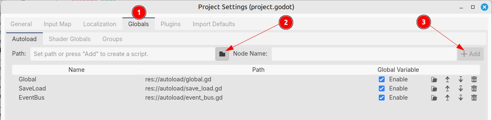
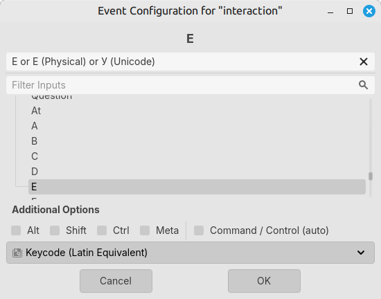
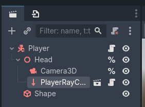
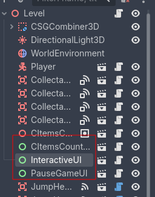

# 3D Платформер

> Часть четвёртая
> 
> [Ссылка на остальные части](https://disk.yandex.ru/d/xVRah6hlUA408g)

## Содержание

- [1. Создание EventBus](#1-создание-eventbus)
- [2. Создание InteractiveItem](#2-создание-interactiveitem)
- [3. Создание PlayerRayCast](#3-создание-playerraycast)
- [4. Создание InteractiveUI](#4-создание-interactiveui)
- [5. Дополнение к уровню](#5-дополнение-к-уровню)

## 1. Создание EventBus

Скрипт EventBus - это место хранения глобальных событий в игре. Из-за особенностей построений сцен в Godot, узлам, находящиеся в разных местах иерархии игры, становится трудно общаться друг с другом. Конечно, можно добится удовлетворительного результата и без данного паттерна, но тогда количество строк кода будет намного больше, чаще всего. Просто можно считать данное решение неким мостом, к которому узлы могут легко достучаться. Главное, хранить только важные сигналы, а не все подряд.

В папке "autoload" создаём файл "event_bus.gd", в котором будет существовать следующий код:

```gdscript
extends Node

signal interactive_ui_shown(item)
signal interactive_ui_hide
signal interactive_item_interacted(item)
```

Чтобы сделать данный скрипт глобальным, зайдём в настройки проекта `Project` ➡️ `Project Settings`, затем в раздел `Globals` ➡️ `Autoload` (рисунок 1-1)

<div style="text-align: center;"></div>
<p align="center">Рисунок 1.1 – Глобальные скрипты</p>

Также, нам понадобится новое событие на нажатие определённой клавиши. Пусть в игре мы будем взаимодействовать с интерактивными объектами нажатием на клавишу `E` (англ.). Чтобы добавить новое событие, заходим в настройки проекта `Project` ➡️ `Project Settings`, затем в разделе `Input Map` добавьте действие `interact` и привяжите клавишу `E` (рисунок 1-2).

<div style="text-align: center;"></div>
<p align="center">Рисунок 1-2 – Добавление события ввода</p>

## 2. Создание InteractiveItem

Базовый класс для всех интерактивных объектов (например, двери, предметы и т.д.).

Создаём новую сцену. Её структура будет примерно следующей:

- `InteractiveItem` (тип `Area3D`)
  - `Mesh` (тип `MeshInstance3D`; `Mesh` ➡️ `New BoxMesh`; вкладка `Surface Material Override` ➡️ `New StandardMaterial3D` ➡️ вкладка `Transparency` ➡️ `Transparency`: `Alpha`, вкладка `Albedo` ➡️ `Color`: `00c10080`)
  - `Shape` (тип `CollisionShape3D`; `Shape` ➡️ `New BoxShape3D`)

Сохраняем сцену в папке `objects` ➡️ `interactive_item` и называем файл `interactive_item.tscn`.

Создаём скрипт для данной сцены:

```gdscript
@tool
class_name InteractiveItem extends Area3D

@export var id: String
@export var ui_name: String
@export var ui_desc: String

@export var size := Vector3.ONE

@onready var _mesh: MeshInstance3D = $Mesh
@onready var _shape: CollisionShape3D = $Shape

func _ready() -> void:
	if not Engine.is_editor_hint():
		set_process(false)
	if not OS.is_debug_build():
		_mesh.hide()
	
	_mesh.mesh = _mesh.mesh.duplicate()
	_shape.shape = _shape.shape.duplicate()
	_set_size()

func _process(_delta: float) -> void:
	if Engine.is_editor_hint():
		_set_size()

func _set_size() -> void:
	_mesh.mesh.size = size
	_shape.shape.size = size
```

## 3. Создание PlayerRayCast

Добавим игроку возможность взаимодействовать с новым объектом класса `InteractiveItem`.

Создаём новую сцену. Её структура будет примерно следующей:

- `PlayerRayCast` (тип `RayCast3D`; `TargetPosition`: `(x: 0, y: 0, z: -3)`, вкладка `Collide With` ➡️ `Areas`: `true`)

Сохраняем сцену в папке `objects` ➡️ `player_ray_cast` и называем файл `player_ray_cast.tscn`.

Создаём скрипт для данной сцены:

```gdscript
class_name PlayerRayCast extends RayCast3D

var _last_object: InteractiveItem

func _physics_process(_delta: float) -> void:
	force_raycast_update()
	if is_colliding():
		var object := get_collider()
		if object is InteractiveItem:
			if not object.disabled:
				if _last_object == null or object != _last_object:
					_last_object = object
					EventBus.interactive_ui_shown.emit(object)
				elif object == _last_object:
					EventBus.interactive_ui_shown.emit(null)
			else:
				EventBus.interactive_ui_hide.emit()
		else:
			EventBus.interactive_ui_hide.emit()
	else:
		EventBus.interactive_ui_hide.emit()
```

Чтобы добавить игроку возможность взаимодействовать с объектами класса `InteractiveItem`, нужно добавить его в иерархию сцены игрока (рисунок 3-1).

<div style="text-align: center;"></div>
<p align="center">Рисунок 3-1 – Добавление PlayerRayCast</p>

## 4. Создание InteractiveUI

Интерфейс данного узла отображает информацию об объекте класса `InteractiveItem`.

Создаём новую сцену. Её структура будет примерно следующей:

- `InteractableUI` (тип `Control`; растяните узел на весь экран)
  - `Margin` (тип `MarginContainer`; вкладка `Theme Overrides` ➡️ `Constants`: `Margin Bottom`: `100`)
    - `Center` (тип `CenterContainer`)
      - `Panel` (тип `PanelContainer`)
        - `Margin` (тип `MarginContainer`; вкладка `Theme Overrides` ➡️ `Constants`: `Margin Left / Top / Right / Bottom`: `10`)
          - рассмотрим отдельно ниже...

Рассмотрим отдельно иерархию у узла `Margin`:

- `Margin` (тип `MarginContainer`; это сам узел `Margin`)
  - `VBox` (тип `VBoxContainer`)
    - `Info` (тип `Label`; `Text` (опционально): `Информация`, `Horizontal Alignment`: `Center`)
    - `HBox` (тип `HBoxContainer`; `Alignment`: `Center`)
      - `Desc` (тип `Label`; `Text`: `Взаимодействовать`)
      - `Icon` (тип `PanelContainer`; вкладка `Theme Override Styles` ➡️ `Panel` ➡️ `New StyleBoxFlat`: `BG Color`: `646464`, вкладка `Corner Radius` ➡️ `Top Left / Top Right / Bottom Right / Bottom Left`: `4`, вкладка `Content Margin` ➡️ `Left / Right`: `6`)
        - `Key` (тип `Label`; `Text`: `E`)

Сохраняем сцену в папке `objects` ➡️ `interactive_ui` и называем файл `interactive_ui.tscn`.

Создаём скрипт для данной сцены:

```gdscript
class_name InteractiveUI extends Control

var _item: InteractiveItem

@onready var _panel: PanelContainer = %Panel
@onready var _info: Label = %Info
@onready var _desc: Label = %Desc

func _ready() -> void:
	_panel.hide()
	_config_signals()

func _config_signals() -> void:
	EventBus.interactive_ui_shown.connect(_on_interactive_ui_shown.bind())
	EventBus.interactive_ui_hide.connect(_on_interactive_ui_hide.bind())

func _on_interactive_ui_shown(new: InteractiveItem) -> void:
	if new == null:
		_panel.show()
	elif not _item == new:
		_item = new
		_info.text = _item.ui_name
		_desc.text = _item.ui_desc
	
	_panel.show()

func _on_interactive_ui_hide() -> void:
	_panel.hide()

func _input(_event: InputEvent) -> void:
	if Input.is_action_just_pressed("interact"):
		if _panel.visible and is_instance_valid(_item):
			EventBus.interactive_item_interacted.emit(_item)
```

> Данный интерфейс нужно добавить на каждый уровень, где присутствуют узлы класса `InteractiveItem` (рисунок 4-1).

<div style="text-align: center;"></div>
<p align="center">Рисунок 4-1 – Добавление InteractiveUI</p>

## 5. Дополнение к уровню

Помимо добавления интерфейса на уровень, также, если есть какие-либо объекты класса `InteractiveItem`, нужно создать код у уровня (родительский узел сцены).

```gdscript
extends Node3D

func _ready() -> void:
	EventBus.interactive_item_interacted.connect(_on_interactive_item_interacted.bind())

func _on_interactive_item_interacted(item: InteractiveItem) -> void:
	match item.id:
		"door": # Пример ID у item
			pass
```

Например, на уровне есть объект класса `InteractiveItem` с ID `door`, ui_name `Дверь?` и ui_desc `Войти`. Также, на уровне есть объект класса `Marker3D` с именем `TeleportMarker3D`, который располагается выше, чем интерактивный предмет. Логика у условного интерактивного предмета такова, что после взаимодействия с ним игрок окажется на позиции объекта `TeleportMarker3D`, т.е. выше, чем условная "дверь".

```gdscript
extends Node3D

@onready var player: Player = $Player
@onready var teleport_marker_3d: Marker3D = $TeleportMarker3D

func _ready() -> void:
	EventBus.interactive_item_interacted.connect(
		_on_interactive_item_interacted.bind()
	)

func _on_interactive_item_interacted(item: InteractiveItem) -> void:
	match item.id:
		"door":
			player.global_position = teleport_marker_3d.global_position
```